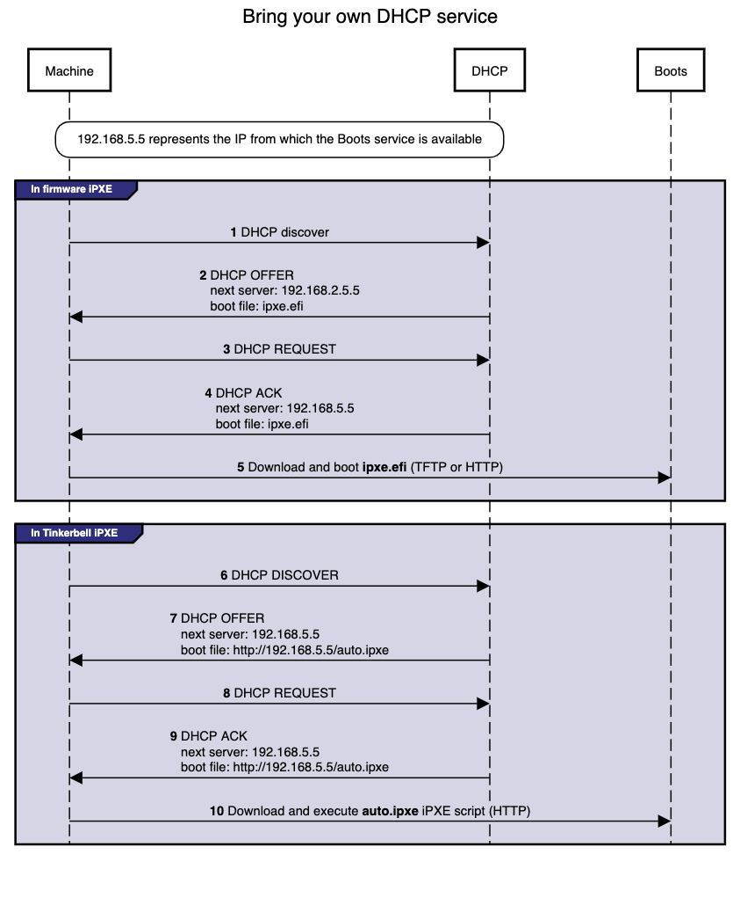

# Using your existing DHCP service with Tinkerbell

In order to facilitate network booting machines, Tinkerbell runs its own DHCP server, Boots. In environments where there is an existing DHCP service that can be configured to respond appropriately to netboot clients, you can disable the DHCP service in Boots and configure this existing DHCP service to respond appropriately. In this scenario the Tinkerbell would have no layer 2 responsibilities. It is important to note that currently, Boots, is responsible for more than just DHCP. So Boots can't be entirely avoided in the provisioning process.

- serving iPXE binaries via HTTP and TFTP
- serving an iPXE script via HTTP
- functions as a SYSLOG server (receiver)

## Process

There is a 2 step interaction between a netboot client and a DHCP service in order to kick off the provisioning process.

- **Step 1**: The machine broadcasts a requests to network boot. The DHCP service then provides the machine with the location of the Tinkerbell iPXE binary. The machine then downloads and boots into the Tinkerbell iPXE binary.

- **Step 2**: The machine again broadcasts a request to network boot. The DHCP service then provides the machine with the location of the Tinkerbell iPXE script. The machine then downloads and runs the Tinkerbell iPXE script. This Tinkerbell iPXE script loads the HookOS into memory.



## Configuration

The following are a few examples of how to configure existing DHCP services to follow the 2 step process described above.

[dnsmasq](https://linux.die.net/man/8/dnsmasq)

dnsmasq.conf

```text
# Tinkerbell requires that the Host must use a reservation (static ip).
dhcp-host=52:54:00:ee:0d:0b,machine1,192.168.2.144
dhcp-option=6,8.8.8.8
dhcp-option=3,192.168.2.1
dhcp-range=192.168.2.0,static

# This is the part that gets us through the iPXE infinite boot loop. https://ipxe.org/howto/chainloading
dhcp-match=tinkerbell, option:user-class, Tinkerbell
dhcp-boot=tag:!tinkerbell,ipxe.efi,none,192.168.2.112
dhcp-boot=tag:tinkerbell,http://192.168.2.112/auto.ipxe
```

[Kea DHCP](https://www.isc.org/kea/)

kea.json

```json
{
  "Dhcp4": {
    "client-classes": [
      {
        "name": "tinkerbell",
        "test": "substring(option[77].hex,0,10) == 'Tinkerbell'",
        "boot-file-name": "http://192.168.2.112/auto.ipxe"
      },
      {
        "name": "default",
        "test": "not(substring(option[77].hex,0,10) == 'Tinkerbell')",
        "boot-file-name": "ipxe.efi"
      }
    ]
  }
}
```

[ISC DHCP](https://ipxe.org/howto/dhcpd)

dhcpd.conf

```text
option client-architecture code 93 = unsigned integer 16;
 if exists user-class and option user-class = "Tinkerbell" {
     filename "http://192.168.2.112/auto.ipxe";
 } else {
     filename "ipxe.efi";
 }
```
