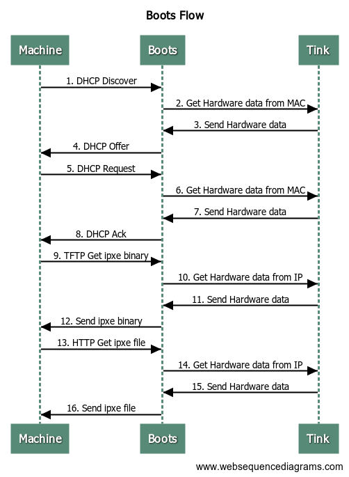

# Boots Design Details

## Table of Contents

- [Boots Flow](#Boots-Flow)
- [Boots Installers](#Boots-Installers)
- [IPXE](#IPXE)

---

## Boots Flow

High-level traffic flow for Boots.



<details>
  <summary>Boots Flow Code</summary>

Copy and paste the code below into [https://www.websequencediagrams.com](https://www.websequencediagrams.com) to modify

```flow
title Boots Flow
# DHCP
note over Machine: DHCP start
Machine->Boots: 1. DHCP Discover
Boots->Tink: 2. Get Hardware data from MAC
Tink->Boots: 3. Send Hardware data
Boots->Machine: 4. DHCP Offer
Machine->Boots: 5. DHCP Request
Boots->Tink: 6. Get Hardware data from MAC
Tink->Boots: 7. Send Hardware data
Boots->Machine: 8. DHCP Ack
note over Machine: DHCP end

# TFTP
note over Machine: TFTP start
Machine->Boots: 9. TFTP Get ipxe binary
Boots->Tink: 10. Get Hardware data from IP
Tink->Boots: 11. Send Hardware data
Boots->Machine: 12. Send ipxe binary
note over Machine: TFTP end

# DHCP
note over Machine: DHCP start
Machine->Boots: 13. DHCP Discover
Boots->Tink: 14. Get Hardware data from MAC
Tink->Boots: 15. Send Hardware data
Boots->Machine: 16. DHCP Offer
Machine->Boots: 17. DHCP Request
Boots->Tink: 18. Get Hardware data from MAC
Tink->Boots: 19. Send Hardware data
Boots->Machine: 20. DHCP Ack
note over Machine: DHCP end

# HTTP
note over Machine: HTTP start
Machine->Boots: 21. HTTP Get ipxe script
Boots->Tink: 22. Get Hardware data from IP
Tink->Boots: 23. Send Hardware data
Boots->Machine: 24. Send ipxe script
note over Machine: HTTP start

```

</details>

## Boots Installers

A Boots Installer is a custom iPXE script.
The code for each Installer lives in `installers/`
The idea of iPXE Installers that live in-tree here is an idea that doesn't follow the existing template/workflow paradigm.
Installers should eventually be deprecated.
The deprecation process is forthcoming.

### How an Installers is requested

During a PXE boot request, an iPXE script is provided to a PXE-ing machine through a dynamically generated endpoint (http://boots.addr/auto.ipxe).
The contents of the auto.ipxe script is determined through the following steps:

1. A hardware record is retrieved based on the PXE-ing machines mac address.
2. The following are tried, in order, to determine the content of the iPXE script ([code ref](https://github.com/tinkerbell/boots/blob/b2f4d15f9b55806f4636003948ed95975e1d475e/job/ipxe.go#L71))
   1. If the `metadata.instance.operating_system.slug` matches a registered Installer, the iPXE script from that Installer is returned
   2. If the `metadata.instance.operating_system.distro` matches a registered Installer, the iPXE script from that Installer
   3. If neither of the first 2 is matched, then the default (OSIE) iPXE script is used

### Registering an Installer

To register an Installer, at a minimum, the following is required

1. A [blank import](https://github.com/golang/go/wiki/CodeReviewComments#import-blank) for your Installer should be added to `cmd/boots/main.go`
2. Your Installer pkg needs an `func init()` that calls `job.RegisterSlug("InstallerName", funcThatReturnsAnIPXEScript)`

### Testing Installers

Unit tests should be created to validate that your registered func returns the iPXE script you're expecting.
Functional tests would be great but depending on what is in your iPXE script might be difficult because of external dependencies.
At a minimum try to create documentation that details these dependencies so that others can make them available for testing changes.

## IPXE

Boots serves the upstream IPXE binaries built from [https://github.com/ipxe/ipxe](https://github.com/ipxe/ipxe).
The IPXE binaries are built from source and then embedded into the Boots Go binary to be served via TFTP.

### Building the IPXE binary

The IPXE binaries from [https://github.com/ipxe/ipxe](https://github.com/ipxe/ipxe) are built via a Make target.

```make
make bindata
```
