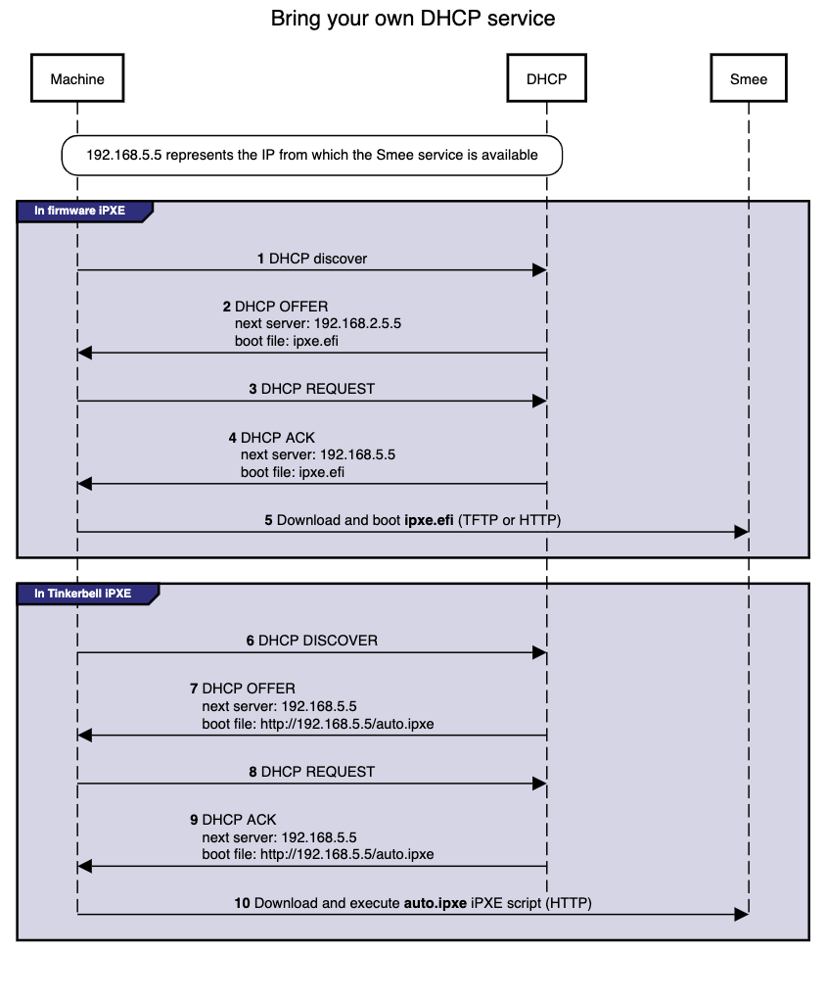

# Use an existing DHCP service

There can be numerous reasons why you may want to use an existing DHCP service instead of Smee: Security, compliance, access issues, existing layer 2 constraints, existing automation, and so on.

In environments where there is an existing DHCP service, this DHCP service can be configured to interoperate with Smee. This document will cover how to make your existing DHCP service interoperate with Smee. In this scenario Smee will have no layer 2 DHCP responsibilities.

> Note: Currently, Smee is responsible for more than just DHCP. So generally speaking, Smee can't be entirely avoided in the provisioning process.

## Additional Services in Smee

- HTTP and TFTP servers for iPXE binaries
- HTTP server for iPXE script
- Syslog server (receiver)

## Process

As a prerequisite, your existing DHCP must serve [host/address/static reservations](https://kb.isc.org/docs/what-are-host-reservations-how-to-use-them) for all machines. The IP address you select will need to be used in a corresponding Hardware object.

Configure your existing DHCP service to provide the location of the iPXE binary and script. This is a two-step interaction between machines and the DHCP service and enables the network boot process to start.

- **Step 1**: The machine broadcasts a request to network boot. Your existing DHCP service then provides the machine with all IPAM info as well as the location of the Tinkerbell iPXE binary (`ipxe.efi`). The machine configures its network interface with the IPAM info then downloads the Tinkerbell iPXE binary from the location provided by the DHCP service and runs it.

- **Step 2**: Now with the Tinkerbell iPXE binary loaded and running, iPXE again broadcasts a request to network boot. The DHCP service again provides all IPAM info as well as the location of the Tinkerbell iPXE script (`auto.ipxe`). iPXE configures its network interface using the IPAM info and then downloads the Tinkerbell iPXE script from the location provided by the DHCP service and runs it.

> Note The `auto.ipxe` is an [iPXE script](https://ipxe.org/scripting) that tells iPXE from where to download the [HookOS](https://github.com/tinkerbell/hook) kernel and initrd so that they can be loaded into memory.

The following diagram illustrates the process described above. Note that the diagram only describes the network booting parts of the DHCP interaction, not the exchange of IPAM info.



## Configuration

Below you will find code snippets showing how to add the two-step process from above to an existing DHCP service. Each config checks if DHCP option 77 ([user class option](https://www.rfc-editor.org/rfc/rfc3004.html)) equals "`Tinkerbell`". If it does match, then the Tinkerbell iPXE script (`auto.ipxe`) will be served. If option 77 does not match, then the iPXE binary (`ipxe.efi`) will be served.

### DHCP option: `next server`

Most DHCP services all customization of a `next server` option. This option generally corresponds to either DHCP option 66 or the DHCP header `sname`, [reference.](https://www.rfc-editor.org/rfc/rfc2132.html#section-9.4) This option is used to tell a machine where to download the initial bootloader, [reference.](https://networkboot.org/fundamentals/)

### Code snippets

The following code snippets are generic examples of the config needed to enable the two-step process to an existing DHCP service. It does not cover the IPAM info that is also required.

[dnsmasq](https://linux.die.net/man/8/dnsmasq)

`dnsmasq.conf`

```text
dhcp-match=tinkerbell, option:user-class, Tinkerbell
dhcp-boot=tag:!tinkerbell,ipxe.efi,none,192.168.2.112
dhcp-boot=tag:tinkerbell,http://192.168.2.112/auto.ipxe
```

[Kea DHCP](https://www.isc.org/kea/)

`kea.json`

```json
{
  "Dhcp4": {
    "client-classes": [
      {
        "name": "tinkerbell",
        "test": "substring(option[77].hex,0,10) == 'Tinkerbell'",
        "boot-file-name": "http://192.168.2.112/auto.ipxe"
      },
      {
        "name": "default",
        "test": "not(substring(option[77].hex,0,10) == 'Tinkerbell')",
        "boot-file-name": "ipxe.efi"
      }
    ],
    "subnet4": [
      {
        "next-server": "192.168.2.112"
      }
    ]
  }
}
```

[ISC DHCP](https://ipxe.org/howto/dhcpd)

`dhcpd.conf`

```text
 if exists user-class and option user-class = "Tinkerbell" {
     filename "http://192.168.2.112/auto.ipxe";
 } else {
     filename "ipxe.efi";
 }
 next-server "192.168.1.112";
```

[Microsoft DHCP server](https://learn.microsoft.com/en-us/windows-server/networking/technologies/dhcp/dhcp-top)

Please follow the ipxe.org [guide](https://ipxe.org/howto/msdhcp) on how to configure Microsoft DHCP server.
